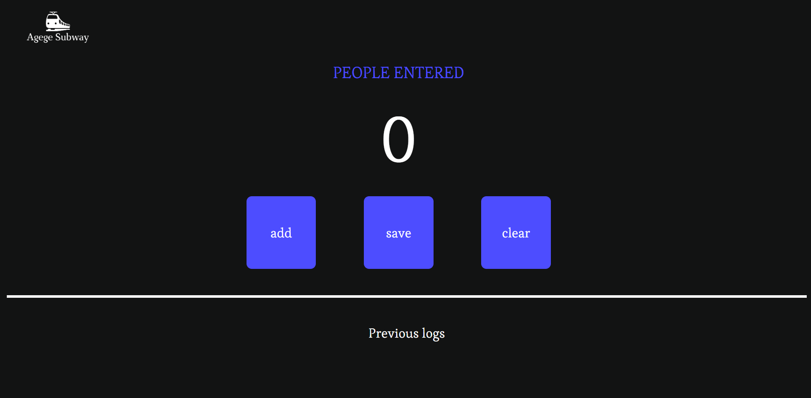
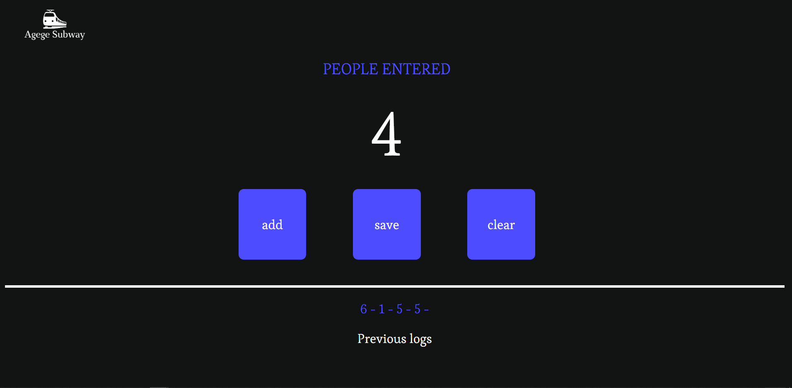
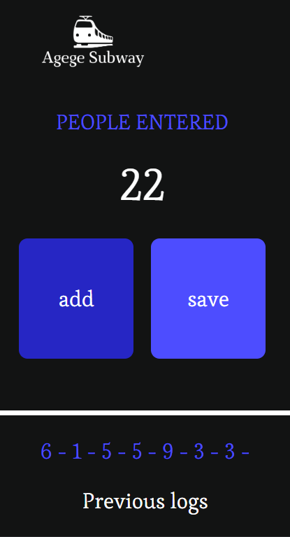
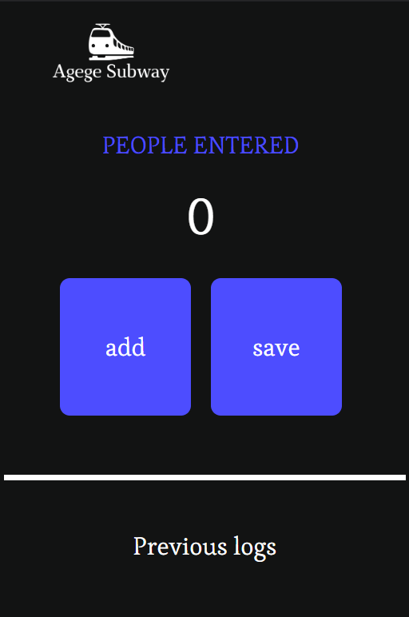

# Agege-Subway Passenger Counter App

Welcome to the Agege-Subway Passenger Counter App! This web application is designed to help you keep track of passenger counts for the Agege-Subway system. Whether you're managing a subway station or just curious about the passenger flow, this app has got you covered.

## Live link
- https://udohufak.github.io/Agege-Subway/

## Features

- **Real-time Counting:** Easily record the number of passengers entering the subway station in real time.
- **Simple Interface:** The user-friendly interface allows anyone to use the app without any hassle.
- **Customizable:** Adapt the app to different subway stations by changing station names, colors, and styles.

## Screenshots

## Technologies Used

- HTML5: Structuring the app's content.
- CSS3: Styling the app for an attractive and intuitive interface.
- JavaScript (ES6+): Implementing the real-time counting functionality.

## How to Use

1. Clone this repository to your local machine using `git clone https://github.com/udohufak/Agege-Subway.git`
2. Navigate to the project directory: `cd Agege-Subway`
3. Open `index.html` in your web browser.
4. Start counting passengers by clicking the "Add" and "Save" buttons.

## Contributing

Contributions are welcome! If you have suggestions for improvements, bug fixes, or new features, please feel free to open an issue or create a pull request. Make sure to follow the [Contributing Guidelines](CONTRIBUTING.md).

## License

This project is licensed under the [MIT License](LICENSE).

## Acknowledgments

- Thanks to the Web2 Advanced Instructor for the inspiration.

---

Developed by [Ufak Udoh](https://github.com/udohufak)
